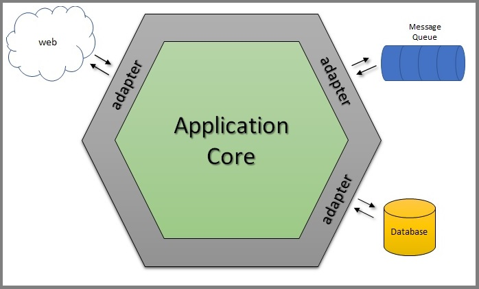

## API-CARTESIAN
> Perform calculation coordinates appling Manhattan distance method \
> Project developed in Golang

### How to run
```bash
$ go run main.go -port=9000 -debug=true
```
`flag` **-port** Port HTTP to server **9000** \
`flag` **-debug** Debug mode

### Build mock tests
To utilize the mocks framework available in  [gomock](https://github.com/golang/mock) \
Instruction to use mocks [gomock-install](https://github.com/golang/mock#go-116)
```bash
GOPATH=$(go env GOPATH) ~/go/bin/mockgen -source=$(pwd)/<path_interface> -destination=$(pwd)/<path_mocks>
```

### Architecture used on the project - Hexagonal
